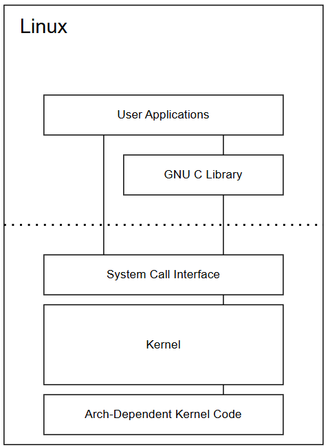
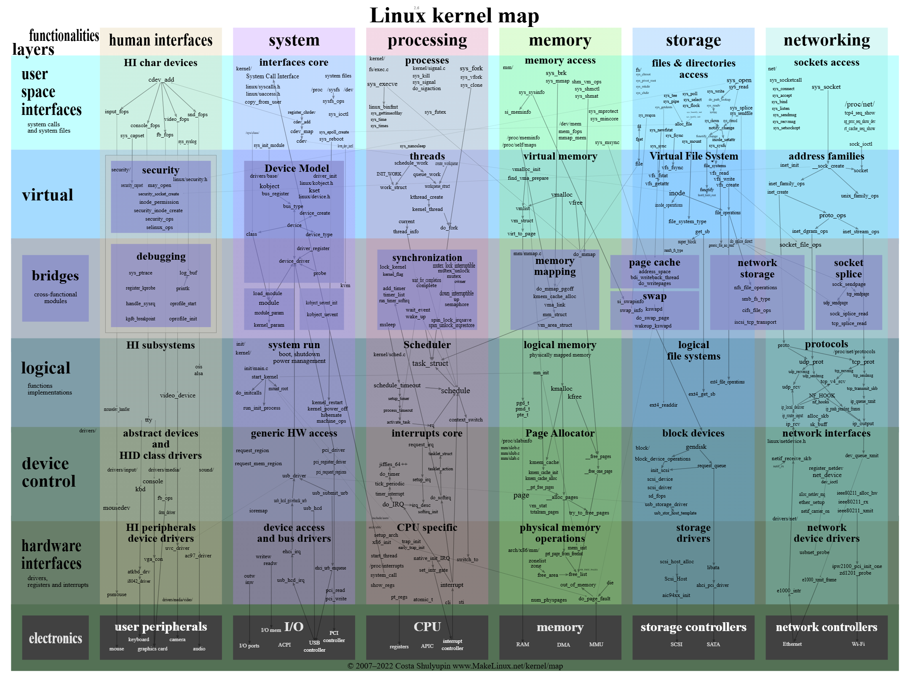
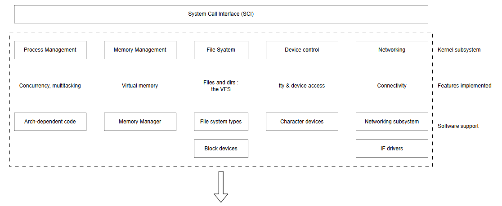
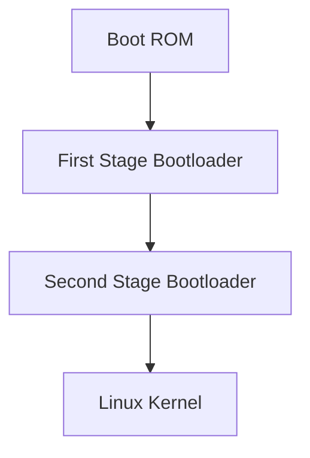
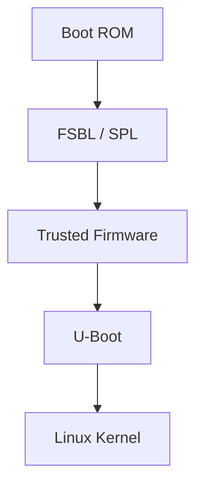

# Linux Kernel 

# 簡介 

在正式開始之前我們先來了解有關 Linux Kernel 的概念

# 作業系統和硬體基本知識

在正式開始 Kernel 之前，先了解所謂的硬體 ～

</br>

## 多處理機系統、對稱多處理機系統、多核心系統 

何謂多處理機系統：多處理機系統（ Multiprocessor Systems）通常也叫做平⾏系統（Parallel Systems）或緊密連接系統（Tightly Coupled Systems）有若⼲個CPU。

多處理機系統它的優點：
* 增加⽣產⼒：可以完成更多的⼯作。
* 較⼤的系統經濟效益：因為系統中有共⽤的資源，⼀個多處理機系統會⽐很多個單處理機系統更經濟。
* 增加可靠度：⼀個處理機的問題不會使整個系統「當機」。

</br>

在多核心系統中我們可以先以硬體與軟體設計兩種方式進行區分：

### 1. 硬體

* 同構多核心架構：系統中的處理器在架構上是相同的，像是雙核心的架構中兩個都為 Cortex-A9

* 異構多核心架構：系統中的處理器在架構上是不同的，像是雙核心的架構中一個為 Cortex-A9、一個為 Cortex-M4

### 2. 軟體設計

* SMP：Symmetric multiprocessing（對稱式架構），多個核心運行一個作業系統，而這個作業系統同等的管理多個內核，這種運作模式就是簡單提升效能。
  * 目前支援此運行模式的作業系統有：Linux，Windows，Vxworks。
  * 目前，我們的PC機使用的就是這種運作模式，一般適用於功能複雜，對即時性要求不高的系統。

* AMP：Asymmetric multiprocessing（非對稱式架構），多個核心相對獨立運作不同的任務，每個核心之間相互隔離，可以運行不同的作業系統或裸機程式。
  * AMP 的運作模式基本上不會有開銷問題，尤其是在執行裸機程式時，甚至沒有開銷，這種模式比較適合即時性高的應用。
  * 兩個核心之間的通訊與資源共享需要有一套優秀的處理機制。
  * 雖然多個核心可以運行不同的系統，但是需要有一個主要的核心，需要使用該核心來控制整個系統以及其他的核心。
    * 例如：一個核心運行運行即時性較高的任務，另一個核心運行 UI 介面。

* BMP：bound multiprocessing，BMP 運作模式與 SMP 類似，同樣也是一個 OS 管理所有的核心，但開發者可以指定將某個任務只在某個指定核心上執行。

</br>

## 雙執行模式

雙執⾏模式（Dual-Mode）：使⽤⼈模式（user mode）和作業系統模式（supervisor mode）。這兩個模式由⼀個模式數元（mode bit）決定。

</br>

---

</br>

## 工具

在開始之前先讓我們建構一個工具環境：User-Mode Linux（UML）。

User-Mode Linux (以下簡稱 UML) 顧名思義是將 Linux 核心移植到 user-space，如此一來，就可將這個修改的核心當作一般的 Linux process 來執行，有以下應用：
* 對與硬體架構無關的一般性 Linux 程式作偵錯與快速測試
* 檢驗 (客製化) 檔案系統的完整性與正確性，特別是 init scripts 相關的部份
* 在單機建構虛擬網路環境，以多個網路單元進行模擬操作
* 搭配 gdb 來追蹤 Linux 核心主體流程，快速測試新的演算法或引入改進
* 易於部署的 Linux 教學環境

</br>

UML 所使用的檔案系統對 Host Linux 來說也不過只是單純的檔案，經由適當配置，我們大可放心對虛擬機器作任何更動，而不必擔憂損害到真實的硬體與系統。

相當重要的觀念是：UML 本身就是全功能的核心，具備專屬的虛擬環境，對硬體的支援僅仰賴於宿主 Linux 系統。


</br>

安裝參考：[UML 安裝](UML-tool-install.md)

</br>

---

</br>

# OS Kernel duty and subsystem

「Linux Kernel 的所有功能」，實際上是在說明一個操作系統核心（Kernel）所承擔的所有責任與子系統。Linux Kernel 是一個模組化、功能完整的單體核心，提供了從資源管理到系統呼叫的全部功能。

</br>

### 核心基礎設施（Core Infrastructure）

| 功能                       | 說明                            |
| ------------------------ | ----------------------------- |
| 初始化子系統（boot/init）        | 啟動流程，執行 `start_kernel()` 等    |
| 記錄與除錯（printk, tracing）   | `printk`, ftrace, debugfs 等   |
| 錯誤處理（panic, oops）        | 當系統發生不可恢復錯誤時提供報告與保護機制         |
| 核心模組支援（Loadable Modules） | `insmod`, `rmmod`, `modprobe` |


</br>

### 程序與排程子系統（Process / Scheduler）

| 功能                   | 說明                                  |
| -------------------- | ----------------------------------- |
| 行程控制（task\_struct）   | 行程資訊資料結構                            |
| 行程排程器（CFS）           | 完整排程策略與切換實作                         |
| 行程建立與管理（fork/clone）  | 系統呼叫如 `fork()`, `clone()`           |
| 行程優先權與時間片            | 動態調整行程 priority、nice、real-time      |
| 工作佇列與 kernel threads | 工作推遲與背景執行支援（`workqueue`, `kthread`） |

</br>

### 記憶體管理（Memory Management, MM）

| 功能                            | 說明                       |
| ----------------------------- | ------------------------ |
| 虛擬記憶體（VMM）                    | 每個 process 擁有獨立虛擬空間      |
| 實體頁管理（Page Allocator）         | 頁面分配與釋放（Buddy system）    |
| 記憶體區塊配置（SLAB/SLUB）            | 針對 kernel object 的快取分配策略 |
| mmap/munmap 支援                | 使用者空間記憶體映射               |
| Demand Paging / Copy-on-Write | 延遲載入與複製優化                |
| Swap（交換空間）支援                  | 不足時移至磁碟                  |

</br>

### 檔案系統（VFS + FS）

| 功能               | 說明                                            |
| ---------------- | --------------------------------------------- |
| 虛擬檔案系統（VFS）      | 抽象層，支援 ext4, FAT, tmpfs, etc.                 |
| 磁碟快取（page cache） | 檔案存取加速                                        |
| 路徑解析與權限管理        | `open()`, `chmod()`, `chown()`                |
| 檔案系統類型支援         | ext2/3/4, XFS, Btrfs, squashfs, ISO9660, etc. |
| 特殊檔案系統           | procfs、sysfs、debugfs、tmpfs、devtmpfs           |

</br>

### 網路子系統（Networking Stack）

| 功能                              | 說明                                           |
| ------------------------------- | -------------------------------------------- |
| 協定支援                            | IPv4, IPv6, TCP, UDP, SCTP, ICMP, RAW socket |
| 網卡驅動支援                          | eth, wlan, loopback, tap/tun 等               |
| Netfilter / iptables / nftables | 封包過濾、防火牆功能                                   |
| socket 介面與 syscalls             | `socket()`, `bind()`, `send()`, `recv()`     |
| 網路 namespace / 虛擬網路設備           | 用於容器、虛擬化環境                                   |

</br>

### 裝置與驅動支援（Device & Drivers）

| 類別                     | 說明                                |
| ---------------------- | --------------------------------- |
| 字元裝置（Character Device） | /dev/tty, /dev/random, 自定義驅動      |
| 區塊裝置（Block Device）     | 磁碟裝置：SATA, NVMe, USB mass storage |
| 網路裝置（Network Device）   | eth0, wlan0 等介面驅動                 |
| I2C / SPI / UART 子系統   | 嵌入式外設驅動介面                         |
| GPIO / PWM / ADC       | 嵌入式輸出入控制                          |
| ALSA / Input / DRM     | 聲音、鍵盤滑鼠、圖形輸出支援                    |
| PCI / USB / ACPI       | 外部匯流排與熱插拔支援                       |

</br>

### 安全性與存取控制（Security & Permissions）

| 功能                         | 說明              |
| -------------------------- | --------------- |
| 權限控制（UID/GID）              | 使用者與群組識別與檢查     |
| 能力（Capability）             | 精細權限劃分          |
| SELinux / AppArmor / Smack | 安全模組與 MAC 框架支援  |
| 安全系統呼叫限制（seccomp）          | 控制哪些 syscall 可用 |

</br>

### 系統呼叫介面（Syscall Interface）

| 功能                     | 說明                                        |
| ---------------------- | ----------------------------------------- |
| 提供給使用者空間的 API          | `read()`, `write()`, `mmap()`, `fork()` 等 |
| 系統呼叫表                  | 每個架構對應自己的 syscall table                   |
| ptrace, audit, tracing | 系統呼叫監控與除錯支援                               |

</br>

### 時間與時鐘（Timers & Clocks）

| 功能                     | 說明            |
| ---------------------- | ------------- |
| 時間中斷（tick）與排程          | 排程器依據 tick 運作 |
| High-resolution timers | 精密時間控制        |
| RTC / TSC / HPET 支援    | 不同硬體時間來源      |
| NTP 同步                 | 網路時間同步機制      |

</br>

### 中斷處理（Interrupts）與同步機制

| 功能                         | 說明                            |
| -------------------------- | ----------------------------- |
| 中斷控制器支援                    | APIC、GIC、etc.                 |
| 中斷服務例程（ISR）                | `request_irq()`, `free_irq()` |
| 工作排程延遲（bottom halves）      | tasklet, workqueue            |
| Spinlocks / Mutex / RWLock | 核心同步                          |
| 原子操作與記憶體障壁                 | `atomic_t`, `smp_mb()` 等      |

</br>

### 容器與命名空間（Namespaces / Cgroups）

| 功能                                      | 說明                             |
| --------------------------------------- | ------------------------------ |
| Cgroups（資源隔離）                           | 限制 CPU、記憶體、IO 使用量              |
| Namespace（命名空間）                         | PID, mount, net, user, IPC 等隔離 |

</br>

### 虛擬化支援（KVM / UML / Xen / VirtIO）

| 功能                   | 說明            |
| -------------------- | ------------- |
| KVM 虛擬機支援            | Linux 原生虛擬化平台 |
| VirtIO 裝置            | 用於高效虛擬化 I/O   |
| UML（User Mode Linux） | 核心跑在使用者空間     |
| Xen PV/HVM guest     | 支援 Xen 架構虛擬化  |

</br>

以上的大項皆為一個作業系統的 Kernel 會有的部分，表格內的功能皆為大概舉例。

</br>

以上都是一些基本的認知，先了解之後後續才能溝通。

---

</br>

# Linux Kernel 預備工作

讓我們再來複習一下 Linux Kernel 是在做甚麼 ～

最簡單的一句話：Kernel 的作用是將 User Space 的請求傳遞給底層驅動程式，並對系統中的各設備和組件進行控制。

</br>

### 核心的任務

從技術層面來形容：核心是硬體與軟體之間的一個中間層。作用是將應用層的請求傳遞給硬體，並充當底層驅動，對系統中的各種設備和組件進行尋址。

所以意思就是說使用者無法透過 User Space 直接控制底層硬體，必須透過 Kernel 的相關操作才可以。

換句話說：核心是一個資源管理程式。負責將可用的共享資源（CPU時間、磁碟空間、網路連線等）分配得到各個系統流程；同時它也像一個函式庫，提供了一組以系統為導向的指令。系統呼叫對於應用程式來說，就像呼叫普通函數一樣。

</br>

### Kernel 實作了解

Kernel 的實作其實可以分為兩種不同的設計理念：

1. 微核心（Microkernel）：
最基本的功能由中央核心（微核心）實作。所有其他的功能都委由一些獨立行程處理，這些行程透過明確定義的通訊介面與中央核心通信。

2. 宏核心（Monolithic Kernel）：
核心的所有程式碼（包含子系統，如記憶體管理、檔案系統、裝置驅動程式）都打包在同一個檔案中。核心中的每個函式都可以存取核心中其他部分。現代宏核心通常支援模組的動態載入/卸載（裁剪）。Linux 核心就是採用這種策略實作。

但現代很多作業系統在實作上會借鑑對方的優點，形成所謂的「混合式核心（Hybrid Kernel）」—— 也就是在宏核心中引入部份微核心的概念，或在微核心中內嵌一些高效能的核心功能，所以理論上這可以分為兩個不同的設計與實作方式需要注意。

為了避免搞混，先具體分類一下：

1. 純粹的微核心系統（Microkernel OS）</br>
代表作：MINIX3、QNX、seL4 </br>
特徵：
   * 核心非常小，只保留最基本的排程、記憶體管理、IPC
   * 驅動程式、檔案系統、網路協定都在使用者空間以獨立進程運行
   * 服務間透過 IPC 互通

</br>

2. 純粹的宏核心系統（Monolithic Kernel OS）</br>
代表作：Linux（可載入核心模組的宏核心）、傳統 UNIX、早期 MS-DOS </br>
特徵：
   * 所有核心子系統（記憶體、檔案系統、網路、驅動）都在同一個核心態運行
   * 彼此可以直接呼叫函式，效能高
   * Linux 雖然支援模組動態載入（LKM），但載入後仍是核心態程式

</br>

3. 混合式核心系統（Hybrid Kernel OS）</br>
代表作：Windows NT、macOS / XNU </br>
特徵：
   * 以宏核心為基礎，但將部分功能（如部分驅動、伺服器）移到使用者空間運行
   * 同時保留核心態的高效能功能
   * 兼顧穩定性與效能

</br>

用上面所提到的 UML 來舉例說明的話：

UML（User Mode Linux）本質上屬於 Linux 宏核心（Monolithic Kernel），只是它的「執行方式」變了—— 它不是跑在裸機或虛擬 CPU 上，而是作為一個使用者空間程式在 Host Linux 上執行。

</br>

兩者的區分：看「核心功能」放在哪裡執行！！！

微核心（Microkernel）
* 核心內只保留最基本功能：
  * 行程排程（Scheduler）
  * 記憶體管理（Memory Mgmt）
  * IPC（進程間通訊）
  * 其他功能（檔案系統、驅動、網路協定）放到使用者空間服務進程去做。

宏核心（Monolithic Kernel）
* 核心內包含完整 OS 功能：
  * 記憶體管理
  * 排程
  * 檔案系統
  * 網路堆疊
  * 裝置驅動
  * 全部在核心態，且可以彼此直接呼叫函式。

</br>

| 判斷項目    | 微核心               | 宏核心         |
| ------- | ----------------- | ----------- |
| 核心功能    | 只留最基本（排程、記憶體、IPC） | 各種子系統全在核心態  |
| 驅動位置    | 使用者空間服務           | 核心態模組或內建    |
| 檔案系統位置  | 使用者空間服務           | 核心態模組或內建    |
| IPC 使用量 | 很多（系統核心與服務間）      | 較少（除非跨系統通訊） |
| 核心大小    | 幾百 KB 級           | MB 級        |
| 效能      | IPC 開銷較大          | 呼叫延遲低       |
| 可靠性     | 模組崩潰可重啟           | 核心崩潰會全系統掛掉  |


</br>

### Kernel 機制

在 Linux 中，凡是涉及硬體資源管理、進程間協作、權限切換的操作，基本都需要透過內核機制。

#### 1. 進程間通訊（IPC, Inter-Process Communication）

* 每個進程有獨立的虛擬地址空間（由 MMU 與內核管理），互相不能直接存取彼此的記憶體。

* 要交換資料，就必須透過內核提供的 IPC 機制，例如：
  * 管道（Pipe / FIFO）
  * System V IPC（消息佇列、共享記憶體、信號量）
  * POSIX IPC（mq_*、shm_*、sem_*）
  * 網路 Socket

* IPC 的核心功能在 ipc/ 子系統。

</br>

#### 2. 進程切換（Context Switch）

* CPU 同一時刻只執行「不多於 CPU 核心數」的進程。

* 內核排程器會決定何時從一個進程切換到另一個進程，這涉及：
  * 保存目前進程的 CPU 暫存器、程式計數器、狀態
  * 載入下一個進程的暫存器與狀態

* 與 RTOS（如 FreeRTOS）任務切換類似，但 Linux 支援更多進程狀態（TASK_RUNNING, TASK_INTERRUPTIBLE...）

</br>

#### 3. 進程調度（Scheduling）

* 內核負責分配 CPU 時間給各個進程，決定：
  * 哪個進程可以執行
  * 執行多久
  * 何時被搶佔

* 由 kernel/sched/ 子系統 實現，常見的排程策略：
  * CFS（完全公平排程器）
  * FIFO、RR（實時排程策略）

</br>

### Kernel Process 管理特性

#### 1. 層次結構（Process Hierarchy）

* 進程之間有父子關係
* 系統啟動後的第一個使用者進程是 init（傳統）或 systemd（現代發行版）
* 內核啟動後會創建 init_task（PID 0），再衍生出 PID 1（systemd/init）

</br>

#### 2. 進程 ID

* 每個進程有唯一的 PID
* 透過 kill, ps, top 等命令可使用 PID 操作進程

</br>

#### 3. pstree 命令

* 以樹狀圖顯示進程父子關係
* 可看到 systemd/init 作為樹根，衍生出其他系統服務與使用者進程

</br>

## Linux Kernel Source Code 的組成與目錄結構

Linux 內核是一個龐大的專案，主要分為三類檔案：

(1) 核心代碼
* 核心功能與子系統：排程器、記憶體管理、VFS、網路、IPC...
* 支撐子系統：電源管理、啟動初始化

(2) 非核心代碼
* 內核自用的 C 函式庫（自包含）
* 固件檔案
* 虛擬化支援（KVM）

(3) 輔助檔案
* 編譯腳本（Makefile、Kconfig）
* 幫助文件（Documentation）
* 授權與維護者資訊

</br>

---

*內核頂層目錄解說*

| 目錄/檔案                                            | 功能                  |
| ------------------------------------------------ | ------------------- |
| `include/`                                       | 內核與外部模組可用的頭文件       |
| `kernel/`                                        | 核心功能（排程器、核心管理等）     |
| `mm/`                                            | 記憶體管理子系統            |
| `fs/`                                            | 檔案系統（VFS）           |
| `net/`                                           | 網路子系統               |
| `ipc/`                                           | 進程間通信               |
| `arch/`                                          | 架構相關代碼（ARM, x86...） |
| `init/`                                          | 系統啟動初始化             |
| `block/`                                         | 區塊設備層               |
| `sound/`                                         | 聲音子系統               |
| `drivers/`                                       | 裝置驅動（占比最大）          |
| `lib/`                                           | 內核使用的通用函式           |
| `crypto/`                                        | 加解密函式庫              |
| `security/`                                      | 安全子系統（如 SELinux）    |
| `virt/`                                          | 虛擬化支援               |
| `usr/`                                           | 生成 initramfs 的程式碼   |
| `firmware/`                                      | 裝置固件                |
| `samples/`                                       | 範例代碼                |
| `tools/`                                         | 開發與測試工具             |
| `Kconfig` / `Makefile` / `scripts/`              | 編譯配置與腳本             |
| `COPYING` / `MAINTAINERS` / `CREDITS` / `README` | 授權、維護者、貢獻者、說明文件     |

</br>

# Linux 內核體系結構簡析

Linux 系統的結構可以分為用戶空間與內核空間兩大部分：

</br>



User Space 不贅述。

<br>

### 內核空間（Kernel Space）

Linux 內核可進一步分為 三層：

#### 1. 系統呼叫接口（System Call Interface, SCI）

* 實作從用戶空間到內核的呼叫機制，例如 read()、write()。
* 依處理器架構不同而異（同一家族 CPU 也可能略有差異）。
* 提供函式呼叫的多路複用/分解功能。
* 架構獨立部分在 kernel/ 目錄，架構相關部分在 arch/ 目錄。

</br>

#### 2. 與架構無關的內核代碼（Architecture Independent Code）

* 為所有 Linux 支援的 CPU 架構提供通用的核心功能，例如：
  * 進程管理（Process Management）
  * 記憶體管理（Memory Management）
  * 虛擬檔案系統（VFS）
  * 網路協定棧（Networking Stack）
  * 設備驅動框架（Drivers Framework）

</br>

#### 3. 與架構相關的內核代碼（Architecture Dependent Code）

* 也就是 BSP（Board Support Package）。
* 負責與特定 CPU 架構（如 x86、ARM、RISC-V）及平台特性對接。
* 包含啟動流程、例外處理、硬體初始化等。

</br>

Linux 內核實作了許多重要的系統架構屬性。在高層或低層的層次上，內核被劃分為多個子系統。

Linux 也可以被視為一個整體，因為它會將所有這些基本服務整合到內核中。這與微核心（Microkernel）的架構不同，微核心只提供一些基本服務，例如通訊、I/O、記憶體與行程管理，而更高階、更具體的服務則是以外部元件的方式插入微核心層中。每種內核架構都有其優點，但這裡不進行深入討論。

隨著時間的推移，Linux 內核在記憶體與 CPU 使用上變得非常高效，且具有極高的穩定性。更有趣的是，在擁有如此龐大與複雜性的前提下，Linux 依然保持了良好的可移植性。編譯後的 Linux 可以運行在大量處理器與不同架構約束、需求的平台上。舉例來說，Linux 可以運行在具備記憶體管理單元（MMU）的處理器上，也可以運行在不提供 MMU 的處理器上。

</br>

## Linux 內核體系結構

Linux 內核包含多個核心子系統，它們協同工作以提供完整的作業系統功能。

再深入講解之前可以看一張很經典的圖：[Linux Kernel Map](https://makelinux.github.io/kernel/map/)



</br>

整張圖大到不可思議，先讓我們來一步一步地看懂這張圖 ～

</br>

### 怎麼看這張圖（先有方向感）

橫向（列）= 分層（layers）

從上到下代表從使用者空間介面一路下沉到硬體：
1. user space interfaces：使用者空間能觸到的系統呼叫與檔案介面
2. virtual：純軟體抽象（例如 VFS、socket API）
3. bridges：跨域的共用基礎（security、debugging、device model）
4. logical：核心功能的實作（排程、記憶體、檔案系統邏輯…）
5. device control：驅動框架與匯流排（platform/PCI/USB/I2C…）
6. hardware interfaces：暫存器、中斷、DMA 等硬體近身對接
7. electronics：最底下是真實硬體（CPU、控制器、裝置）

</br>

縱向（欄）= 領域（domains）

由左到右大致分成 6 大域：
1. human interfaces（人機/輸入輸出）
2. system（系統核心）
3. processing（處理/排程）
4. memory（記憶體）
5. storage（儲存/檔案）
6. networking（網路）。

</br>

顏色方塊與箭頭

方塊代表一個子系統或主題，箭頭代表典型的呼叫/資料流。

有些半透明大框（例如 Device Model、security、debugging）是跨欄位/跨層的基礎設施，會滲透到多個區域。

</br>

### 逐欄導覽

#### human interfaces（人機介面）

* HI char devices：
  * 終端機、輸入裝置等字元裝置（drivers/char/、drivers/input/）。

* security / debugging（跨欄基礎）：
  * LSM（SELinux/AppArmor，security/）、printk、tracepoints、ftrace、perf（kernel/trace/、tools/）。

---

</br>

#### system（系統核心）

* interfaces core / System Call Interface：
  * 系統呼叫進入點與分派（kernel/、arch/*/entry*）。

* Device Model（跨欄基礎）：
  * 驅動模型、kobject/kset、sysfs（drivers/base/、lib/kobject.c）。

* system run：
  * 啟動與關機、電源管理（init/、kernel/power/）。

---

</br>

#### processing（處理/排程）

* threads / Scheduler：
  * struct task_struct、CFS、RT sched（kernel/fork.c、kernel/sched/）。

* interrupts core：
  * 中斷子系統（kernel/irq/、arch/*/kernel/irq*.c）。

* synchronization：
  * spinlock、mutex、RCU、原子操作（kernel/locking/、include/linux/）。

* CPU specific：
  * SMP、per-CPU 變數、IPI（arch/*/kernel/smp*.c、kernel/smp.c）。

---

</br>

#### memory（記憶體）

* memory access：
  * copy_to_user()/get_user() 之類的使用者/核心拷貝（include/linux/uaccess.h）。

* virtual memory / memory mapping：
  * mmap()、vm_area_struct、page fault（mm/mmap.c、mm/fault.c）。

* logical memory / Page Allocator：
  * 夥伴系統、SLAB/SLUB（mm/page_alloc.c、mm/slub.c）。

* physical memory operations：
  * DMA、IOMMU、頁面屬性（kernel/dma/、drivers/iommu/、arch/*/mm/）。

---

</br>

#### storage（儲存/檔案）

* files & directories access / Virtual File System：
  * VFS 抽象與 open/read/write 路徑（fs/、尤其 fs/open.c、fs/read_write.c、fs/namei.c）。

* page cache：
  * 檔案快取、重入讀寫（mm/filemap.c）。

* swap / network storage：
  * 交換分頁、NFS 等（mm/swapfile.c、fs/nfs/）。

* logical file systems：
  * ext4、XFS、Btrfs…（fs/ext4/、fs/xfs/、fs/btrfs/）。

* block devices / storage drivers：
  * 通用區塊層與磁碟/控制器驅動（block/、drivers/block/、drivers/scsi/、drivers/nvme/）。

---

</br>

#### networking（網路）

* sockets access：
  * socket()/sendmsg()/recvmsg()（net/socket.c）。

* address families：
  * AF_INET/AF_UNIX/AF_PACKET（net/ipv4/、net/unix/、net/packet/、include/net/）。

* protocols：
  * TCP/UDP/ICMP、路由、Netfilter/nftables（net/ipv4/、net/ipv6/、net/netfilter/）。

* network interfaces / network device drivers：
  * netdev 核心與 NIC 驅動（net/core/、drivers/net/）。

---

</br>

### 試著連續看與實作

#### read() 讀檔路徑（system → storage）

1. system（interfaces core）：使用者呼叫 read(fd, buf, len) → 進入 __x64_sys_read（或對應架構）

2. storage（files & directories access）：VFS 層 vfs_read()/__vfs_read() → 根據 inode 的 file_operations -> read_iter 分派

3. storage（Virtual File System / page cache）：命中頁面快取就直接拷貝；不命中則走 readpage()/readahead

4. storage（logical file systems）：ext4/xfs 實作把邏輯位移換算成磁區

5. storage（block devices）：通過通用區塊層佇列 I/O 請求

6. device control → hardware interfaces：儲存控制器驅動（SATA/NVMe/SCSI）發 DMA 到裝置

7. 返回資料 → page cache → 複製到 user buffer（copy_to_user() 在 memory / memory access）

</br>

- 對照原始碼：fs/read_write.c, mm/filemap.c, fs/ext4/, block/, drivers/nvme/host/…

- UML/真機實驗：strace -e read cat 大檔案 + perf record -g 看呼叫鍊；ftrace 追 vfs_read/ext4_read_iter。

</br>

---

接下來我會從系統的主要結構切入。

</br>

## Linux 內核結構

我會從最接近 User Space 的地方開始說明，並一路往下。

在學習 Kernel 的路上請一律先不要執著在 `打 code` 上，先好好了解架構與原理。

</br>




</br>

### 1 ) System Call Interface（SCI）：系統調用接口

可以先把這一層想像成是使用者與 Kernel 溝通的介面，一般 Application 不應該、也無法直接呼叫 Kernel 內部任意函式。

在我們設計一個 Linux 的 Application 時並不會實際對 Kernel 中的功能做更改或是操作，我們頂多就是調用一些 API，那想當然不同版本的 Linux Kernel 所提供的 API 當然會不一樣。

- `./linux/kernel`：SCI 的實現

- `./linux/arch`：SCI 依賴於系統結構的部分

</br>

因為這些函式存在於 Kernel Space，而 Application 執行於 User Space，兩者不只位於不同的虛擬記憶體區域，也具有不同的 CPU Privilege Level。

例如，User Space 想要：讀取檔案、建立 Process、配置 Memory、建立 Socket、控制 Device、等待 Event、取得時間 ... 等等功能，都需要透過 Kernel 對 User Space 公開的介面。

</br>

#### API、Library Function、System Call、Kernel Function 的差別

這裡是一個非常容易混淆的地方。我們平常在 Linux Application 裡寫：`read(fd, buffer, size);` 很容易直覺認為：`read() = System Call` 但嚴格來說不一定能這樣理解。

完整結構比較接近：

```sql
Application 
    │ 
    │ C Function Call 
    ▼ 
libc 
    │ 
    │ System Call Wrapper 
    ▼ 
CPU System Call Instruction 
    │ 
    ▼ 
Linux Kernel 
    │ 
    ▼ 
Kernel System Call Handler
```

</br>

也就是說：`read()` 通常首先是一個 libc 提供給 Application 的 wrapper function。

glibc 再根據 CPU Architecture：
1. 準備 System Call Number
2. 準備參數
3. 將參數放入指定 Register
4. 執行 CPU 的 System Call Instruction
5. 取得 Kernel Return Value
6. 處理 errno
7. 返回 Application

Linux System Call 通常不是 Application 自己直接以組合語言進入 Kernel，而是由 glibc 等 C library 的 wrapper 代為處理。

</br>

System Call Wrapper 是什麼？ 中文常翻譯為「系統呼叫包裝函式」。它是位於應用程式與作業系統核心（Kernel）之間的ㄧ層捷徑函式，主要負責打包參數、觸發軟體中斷以及轉交系統呼叫。

它主要負責：
1. 接收 C function arguments
2. 按照 Linux System Call ABI 準備參數
3. 準備 System Call Number
4. 執行 CPU System Call Instruction
5. 接收 Kernel Return Value
6. 將 Kernel Error 轉換成 errno
7. 返回 Application

</br>

# Bootloader

我們已經先瞭解了 Linux Kernel 的基本架構與 System Call Interface。

那接下就來有一個問題了：Linux Kernel 是如何開始執行的 ~

</br>

假設我們現在有一份已經編譯完成的 Linux Kernel：Image、zImage、Image.gz、uImage 與 image.ub

CPU 剛剛上電時，並不會自動知道：
- Linux Kernel 在哪裡？
- Kernel 要載入 RAM 的哪個位置？
- DDR 初始化了嗎？
- Device Tree 在哪裡？
- Root File System 在哪裡？
- Kernel Command Line 是什麼？

在 Linux Kernel 正式執行之前，必須先有其他程式負責：

```spl
硬體初始化
    ↓
找到 Kernel
    ↓
將 Kernel 載入 RAM
    ↓
準備 Kernel 所需要的資訊
    ↓
將 CPU 控制權交給 Kernel
```

這一類程式就是 Bootloader，他是在 Operating System Kernel 開始執行之前所執行的軟體，負責建立 Kernel 可以開始工作的執行環境，載入 Kernel 及相關資料，最後將 CPU 控制權交給 Kernel。

</br>

但今天若是在 Embedded Linux 中可能就不會是只有 Bootloader 這麼簡單，他通常是：



甚至有一些複雜的平台會是：




</br>

# root file system


</br>

# Linux Kernel Driver

如何去實作一個 Kernel Driver 呢 ?

其實我悶需要先判斷自己需要的是甚麼，以匯流排周邊來說我們需要的可能就是 Driver 去控制周邊的 pin 同時也包含 input/output

</br>