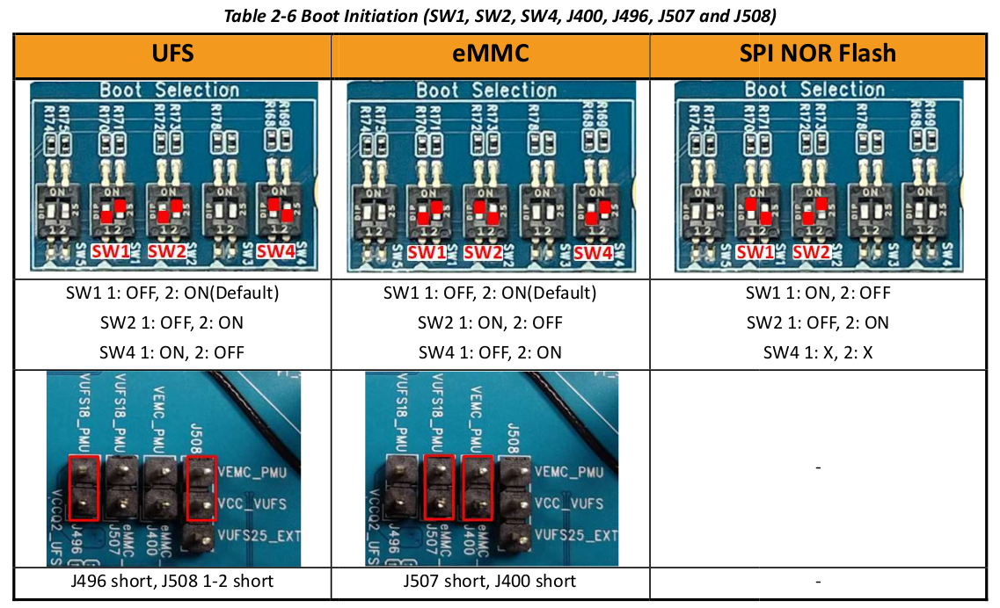

# MTK Genio 720 EVK 開發筆記

這邊的開發與講解都以 Ubuntu 22.04 為主。

若是只有 windows 的話 請自行架設 docker 環境。

</br>

# Yocto Project 安裝

參考：[MediaTek Genio Community](https://genio-community.mediatek.com/t/build-genio-720-520-evk-images-from-latest-iot-yocto-v25-1-dev/939)、[官方 Yocto 教學](https://mediatek.gitlab.io/aiot/doc/aiot-dev-guide/master/sw/yocto/get-started/env-setup/build-env-linux.html)

</br>

可以先根據官方與論壇所提供的方式安裝，基本上 MTK 有提供 repo 倉庫所以直接 'sync' 就可以了。

</br>

---

## 簡介

Genio 720 與 520 基本共用同一個 BSP。Yocto 開發版本基本為 Yocto v25.1-dev

</br>

MTK 基本把所有開發需要的 SDK 都放在 [GitLab](https://gitlab.com/mediatek/aiot)，那 Yocto 所需要的 branch 為 scarthgap，在 clone 或是找資料時都需要注意。

[參考](https://mediatek.gitlab.io/aiot/doc/aiot-dev-guide/master/sw/yocto/get-started/build-code.html)

</br>

## 安裝步驟

</br>

### Step 1. 安裝 repo 

repo 是 Google 提供用來同時放置多個 git 倉庫的工具。我們需要先自己安裝：

1. 設置 repo 環境

```bash
mkdir -p ~/bin
```
```bash
PATH="${HOME}/bin:${PATH}"
```
```bash
curl https://storage.googleapis.com/git-repo-downloads/repo > ~/bin/repo
```
```bash
chmod a+rx ~/bin/repo
```

</br>

2. 安裝相依工具

這裡包含 repo 所需要的與 Yocto 需要的，記得裝之前 update 一下。

```bash
sudo apt install libssl-dev 
```

```bash
sudo apt-get install gawk wget git diffstat unzip texinfo gcc build-essential chrpath socat cpio python3 python3-pip python3-pexpect xz-utils debianutils iputils-ping python3-git python3-jinja2 libegl1-mesa libelf-dev libsdl1.2-dev lz4 pylint xterm python3-subunit mesa-common-dev libstdc++-12-dev libssl-dev
```

```bash
sudo apt-get install liblz4-tool
```

---

</br>

### Step 2. Fetch MTK GitLab

像前面所說 MTK 把東西都放在 GitLab 所以我們需要先對 Host 做一些環境設定，再進行 clone。

1. GitLab 帳號設定

先辦一個 GitLab 帳號

```bash
echo "machine gitlab.com login <USER NAME> password <PASSWORD>" \
> $HOME/.netrc
```

`<USER NAME>` 與 `<PASSWORD>` 為自己的 GitLab 資訊。

設定資訊檔案權限

```bash
chmod 600 $HOME/.netrc
```

</br>

2. 創建 workspace 與 fetch 

首先該 SDK 是在 `rity/scarthgap` 這個 branch。

創立 workspace

```bash
mkdir iot-yocto; cd iot-yocto
```

fetch SDK

```bash
repo init -u https://gitlab.com/mediatek/aiot/bsp/manifest.git -b refs/tags/rity-scarthgap-v25.1

repo sync
```

這邊下載會需要一點時間。

---

</br>

### Step 3. 設定 Yocto Build 環境

這裡需要對 Yocto Bitbake 的時候，需要的 downloads 與 sstate-cache 做設定。

```bash
mkdir iot-yocto; cd iot-yocto #創自己要的 workspace folder name 就好

export PROJ_ROOT=`pwd`
```

```bash
source src/poky/oe-init-build-env <floder name>
```

`<floder name>` 為自己想要的資料夾名稱，通常叫 `build` 就可以。

創建完成 `build` 資料夾後，會直接進入該資料夾，若沒有的話則代表設定有誤。

```bash
export BUILD_DIR=`pwd`
```

先記下現在的位置，之後要用到。

</br>

接下來要對 `build\conf\local.conf` 輸入一些設定：

注意不會直接輸入在 local.conf 中，會有一個額外的 site.conf

```bash
echo 'NDA_BUILD = "0"' >> $BUILD_DIR/conf/site.conf
# 我們沒有 NDA access 所要用 0 先將 NDA 這邊設定為 0，NDA 是需要向 MTK 額外申請的。
```

```bash
echo 'DL_DIR = "${TOPDIR}/../downloads"' >> $BUILD_DIR/conf/site.conf
```

```bash
echo 'SSTATE_DIR = "${TOPDIR}/../sstate-cache"' >> $BUILD_DIR/conf/site.conf
```


---

</br>

### Step 4. 開始編譯

根據不同的 image 設定會有不同對應的 MACHINE。

UFS：
```bash
export MACHINE=genio-720-evk-ufs
```

eMMC：
```bash
export MACHINE=genio-720-evk
```

NOR：
```bash
export MACHINE=genio-720-evk-norboot-ufs
```

</br>

開始編譯：

在編譯前，我們需要做兩項設定：

1. 關掉 ptest
    - 編輯 local.conf 
    - 輸入 
    ```conf
    PTEST_ENABLED = "0"
    DISTRO_FEATURES:remove = "ptest"
    EXTRA_IMAGE_FEATURES:remove = "ptest-pkgs"
    ```
    - 因為我們不是測試與專業開發人員，所以不用這項功能，我們只是拿 SDK 做開發。

2. 限制 Yocto 的執行資源
    - 編輯 local.conf 
    - 輸入 
    ```conf
    BB_NUMBER_THREADS = "4"
    PARALLEL_MAKE = "-j 4"
    ```
    - 限制一下 Bitbake 在編一時的執行，否則電腦容易死掉。

此為完整編譯。

```bash
bitbake rity-demo-image
```

自行製作的 image：

```bash
bitbake #後續更新
```

---

</br>

## 燒錄

### 安裝 genio-flash tool

[參考](https://mediatek.gitlab.io/aiot/doc/aiot-dev-guide/master/tools/genio-tools.html#setup-tool-environment-linux)

安裝上容易遇到一些權限或是版本問題，直接問 GPT 他很棒！！

</br>

### 上板

[參考](https://mediatek.gitlab.io/aiot/doc/aiot-dev-guide/master/sw/yocto/get-started/flash.html)

先根據編譯的 image 對象決定跳排，如圖：



</br>

燒錄步驟：

1. 接上 USB3.2 P0 Download Port
2. 持續按下 Download 按鈕
3. 按一下 Reset 按鈕
4. 看到 log 出現 `Erasing 'mmc0'` 就可以鬆開 Download

每次重新 flash 的時候最好退出資料夾在重新進去一次

</br>

</br>

# MTK Genio 720 EVK 開發

### [Making your OWN meta-layer](layer/Readme.md)

### [USB 開發相關](USB/Readme.md) 

### [NPU](NPU/Readme.md)

### [LCM Genio 720 開發 repos](https://github.com/YBJin0902/Genio_720_Development/tree/master/meta-lcm)