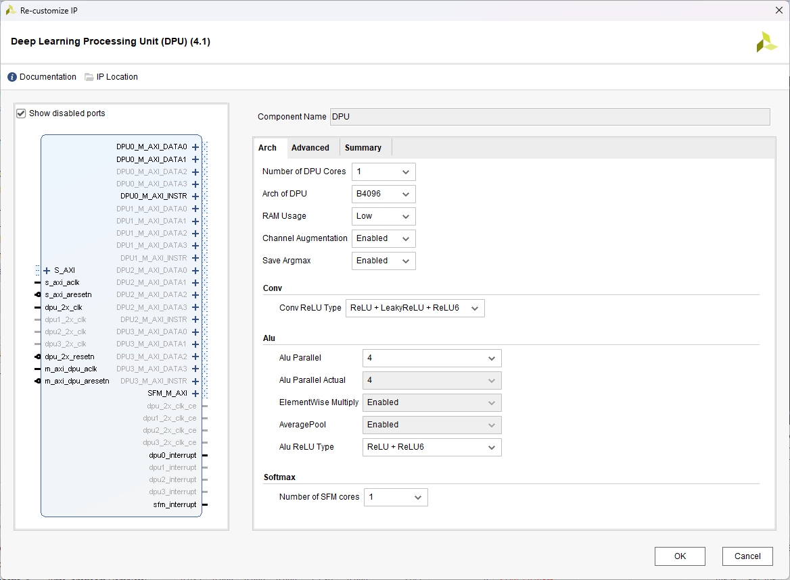
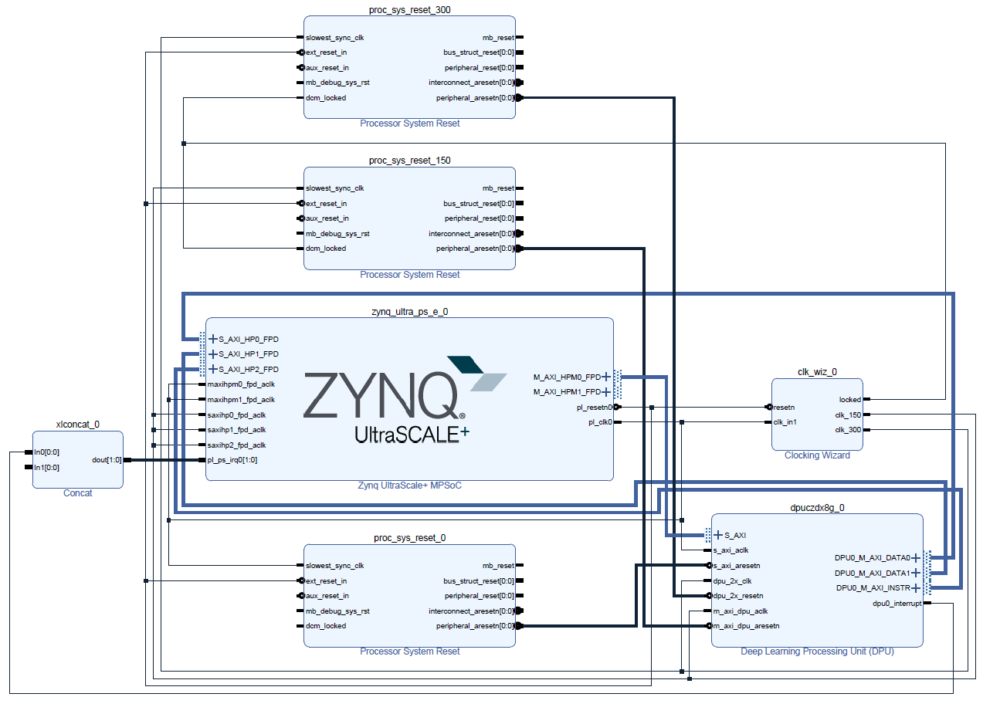

# DPU

這邊介紹 DPU 以及在 Xilinx 上如何使用，主要以 Vivado 與 Petalinux 為主。

</br>

## 簡介

DPU 是 Xilinx（現屬 AMD）為嵌入式硬體平台（如 Zynq SoC、Versal ACAP）與加速卡（如 Alveo）專門設計的高效能深度學習推論引擎。簡單來說，它是一顆專門為了加速神經網路運算而打造的「軟核（Soft IP）」，透過在 FPGA 內部的邏輯資源上實作，讓模型執行速度能達到 CPU 無法企及的等級。

講簡單一點你可以把它想像成是在 FPGA 上面跑的 NPU。那既然是在 FPGA 上面跑他當然無法計算 float 這種小數，當然你自己寫的 DPU 除外，官方提供的功能當然沒有這麼高級。所以，可以想像成一個閹割過後的 NPU 在你的設備上，所以模型與量化都需要慎選。

以下筆記會分成：硬體製作、Petalinux 安裝與模型製作來說明，剛好是完整的流程。

</br>

我使用的版本：
- Vivado 2023.1
- Petalinux 2023.1
    - linux-xlnx 6.1
    - u-boot 2023.1
- DPU 
    - vitis-ai 3.5
    - DPU IP DPUCZDX8G 

</br>

</br>

# 章節

### [Workflow](#workflow-1)

### [Get Start](#get-start-1)

### [Vivado 硬體製作](#vivado)

### [Petalinux 軟體測試]()

### [模型製作]()

### [Petalinux 推論]()

</br>

</br>

# Workflow

在 vitis ai 中會分為兩種 workflow：vivado flow 與 vitis flow。

</br>

### Vivado flow

Vivado Design Suite 是 Xilinx 經典的硬體設計工具，採取的是硬體中心（Hardware-Centric）的方法。

著重於晶片內部的暫存器轉移級（RTL）設計、暫存器與邏輯閘的配置。開發者需要像傳統硬體工程師一樣，透過 Block Design 來搭建系統。

</br>

### Vitis flow

Vitis Unified Software Platform 是 AMD 為了讓軟體工程師也能輕鬆使用 FPGA 進行高效能加速而推出的現代化平台，採取軟體中心（Software-Centric）的方法。

隱藏底層複雜的硬體佈局細節。開發者可以專注於演算法本身（使用 C/C++ 或 OpenCL），透過 Vitis 編譯器自動將軟體函數轉換為硬體加速核心（Hardware Kernels），並與主機端（Host CPU）無縫整合。

</br>

簡單來說，Vivado flow 就是先使用 Vivado 搭建 DPU IP 並且產生完整的硬體平台後再作使用，


</br>

# Get Start

首先須準備相對應的 IP，須注意 Xilinx 所提供的 DPU IP 會根據使用的 SoC 型號不一樣而有所不同。以我的開發板 (ZCU104, MPSoC) 為例如下圖所示，我應該要選 DPUCZDX8G。

</br>


</br>

根據官網提供資源下載即可。

</br>


</br>

在繼續之前先了解 Xilinx DPU IP 所提供的功能：

AMD 深度學習處理器單元 (Deep Learning Processor Unit, DPU) 是一個可程式化引擎，專用於卷積神經網路。此單元包含暫存器配置模組、資料控制器模組及卷積運算模組。

DPU 具備專門的指令集，讓 DPU 能有效率地為多種卷積神經網路進行運算。部署於 DPU 的卷積神經網路包括 VGG、ResNet、GoogLeNet、YOLO、SSD、MobileNet、FPN 等等。

DPU IP 能以區塊方式整合於所選 Zynq™ 7000 晶片上系統 (System-on-Chip, SoC) 和 Zynq UltraScale™+ 多處理器晶片上系統 (Multiprocessor system-on-chip, MPSoC) 器件中的可程式化邏輯 (Programmable Logic, PL)，並直接連接至處理系統 (Processing System, PS)。若要使用 DPU，您應將指令和輸入影像資料備妥於 DPU 能存取的特定記憶體位址。DPU 運作也需要應用處理單元 (Application Processing Unit, APU) 回應中斷，以協調資料傳輸。

以下列表重點介紹了 DPUCZDX8G 支援的 operators：
- Supports both Convolution and transposed convolution
- Depthwise convolution and depthwise transposed convolution
- Max pooling
- Average pooling
- ReLU, ReLU6, Leaky ReLU, Hard Sigmoid, and Hard Swish
- Elementwise-sum and Elementwise-multiply
- Dilation
- Reorg
- Correlation 1D and 2D
- Argmax and Max along channel dimension
- Fully connected layer
- Softmax
- Concat, Batch Normalization

</br>

了解完 DPU 的基本介紹後我們就可以繼續開始搭建整個專案。這邊不贅述太細節的操做 (例如：vivado 加入 IP 等)，主要講解如何使用 DPU 與 Petalinux 的調用。

</br>

# Vivado

Xilinx 這一個 DPU 的 IP 基本上是針對 CNN 去做設計的，所以在上面跑最好的模型想當然一定是用 CNN 架構的模型。

有一個特別的點需要注意，不管今天你的 DPU 設定的卷積層有多大，Vivado 在編譯這一個 DPU 會需要消耗相當大的電腦資源，除了相當消耗時間之外，還需要多一點的 RAM 最好準備 32GB 以上，我自己以 16GB 的電腦做訓練時會發生 Vivado 錯誤，需要特別注意 ! ! ! 

</br>

---

### Step 1. Vivado 安裝 DPU

這邊直接以加入 IP 的方式加入下載好的 DPU 倉庫即可。

</br>

---

### Step 2. DPU 設定

基本上可以透過 [Xilinx DPU 官方文件 PG338](https://docs.amd.com/r/3.2-English/pg338-dpu) 搭配做設定。

直接對 IP 雙擊兩下可以直接進入 IP 設定。如下圖所示。

</br>



由上至下依序解釋：</br>

#### 1. Number of DPU Cores

- 決定一個 IP 包含幾個獨立的 DPU 核心，每個核心都可以獨立執行一個推論工作。

- 核心數增加時，大部分資源接近線性增加： $Resource_{total}$ ​≈ $Resource_{core}​$ × $N_{cores}$ ​+ $Shared$ $Logic$
    - 例如 B4096、High DSP Usage 單核心基礎配置約需要 642 DSP。理想估算：

</br>

| 核心數 | 基礎 DSP 粗估 |
| :--: | :--------: |
|   1 |     約 642 |
|   2 |    約 1284 |
|   3 |    約 1926 |
|   4 |    約 2568 |

</br>

#### 2. Arch of DPU

- 決定卷積運算陣列的平行度，`Bxxxx` 表示理論上每個 DPU clock cycle 能完成的運算數
    - B512
    - B800
    - B1024
    - B1152
    - B1600
    - B2304
    - B3136
    - B4096

- 提高運算陣列平行度不會讓模型變得「更準」，只會提高可用的硬體平行度。

- 三個平行維度，DPU 卷積陣列包含：
    - PP：Pixel Parallelism，像素平行度
    - ICP：Input Channel Parallelism，輸入通道平行度
    - OCP：Output Channel Parallelism，輸出通道平行度
    - 峰值運算量為： $OPS$ / $cycle$ = $PP$ × $ICP$ × $OCP$ × $2$

</br>

| 架構    | PP | ICP | OCP | 理論 OPS/clock |
| ----- | -: | --: | --: | -----------: |
| B512  |  4 |   8 |   8 |          512 |
| B800  |  4 |  10 |  10 |          800 |
| B1024 |  8 |   8 |   8 |         1024 |
| B1152 |  4 |  12 |  12 |         1152 |
| B1600 |  8 |  10 |  10 |         1600 |
| B2304 |  8 |  12 |  12 |         2304 |
| B3136 |  8 |  14 |  14 |         3136 |
| B4096 |  8 |  16 |  16 |         4096 |

</br>

#### 3. RAM Usage

- 控制每個 DPU Core 使用多少片上緩衝記憶體。

- 選項通常為：Low or High

- DPU 使用片上 RAM 暫存：
    * 權重
    * Bias
    * 輸入／輸出 Feature Map
    * 中間運算資料
    * 卷積資料區塊

- 每核心 BRAM36K 使用量

</br>

| 架構    |   Low |  High |  增加量 |
| ----- | ----: | ----: | ---: |
| B512  |  73.5 |  89.5 |   16 |
| B800  |  91.5 | 109.5 |   18 |
| B1024 | 105.5 | 137.5 |   32 |
| B1152 |   123 |   145 |   22 |
| B1600 | 127.5 | 163.5 |   36 |
| B2304 |   167 |   211 |   44 |
| B3136 |   210 |   262 |   52 |
| B4096 |   257 | 317.5 | 60.5 |

</br>

#### 4. Channel Augmentation

- Channel Augmentation 用來改善「輸入通道數很少」時的硬體利用率。
    - 典型問題是第一層 RGB 影像只有三個通道：Input shape = H × W × 3，正常情況下，第一層一次能處理 16 個輸入通道，實際只有 3 個，因此大量乘法器閒置。Channel Augmentation 會重新安排像素與通道資料，使這種低通道卷積更有效利用 DPU 平行運算單元。

</br>

#### 5. DepthwiseConv

- 決定 DPU 是否原生支援 Depthwise Convolution。

- Depthwise Separable Convolution 分兩步：
    1. Depthwise Convolution：每個輸入通道獨立做空間卷積
    2. Pointwise Convolution：使用 `1×1` 卷積混合不同通道

- 普通卷積：$Y_o$ = $\sum_i$ $X_i$ * $K_{i,o}$

- Depthwise 卷積：$Y_i$ = $X_i$ * $K_i$

</br>

#### 6. AveragePool

- 決定 DPU 是否支援 Average Pooling。

- 只支援正方形 pooling kernel。

- 開啟後 Average Pooling 可以直接在 DPU 上執行，不必交由 CPU 或其他子圖處理。

</br>

#### 7. ReLU Type

- 控制 DPU 支援的 Activation 類型。

- ReLU + ReLU6
    - ReLU：$f(x)$ = $\max(0,x)$
    - ReLU6：$f(x)$ = $\min$$(\max(0,x),6)$

- ReLU + LeakyReLU + ReLU6
    - 除了上述功能，額外支援 LeakyReLU：$f(x)$ = $\begin{cases}x,&x\geq0 \\ 0.1x,&x<0\end{cases}$

</br>

#### 8. Softmax

- 決定是否在 FPGA 中加入硬體 Softmax 模組。

- 加入的話需要在 vivado 接線中加入其他 AXI Interface 做連接。

- 官方指出，硬體 Softmax 最多可能比軟體實作快約 160 倍。但這是 Softmax 算子本身，不代表整個 CNN 模型加速 160 倍。

</br>

以上大概是整個會需要調整到的 IP 設定。

</br>

---

### Step 3. Vivado 接線

```txt
這邊沒有示範到 softmax，softmax 基本上直接按 auto 就可以了。
```

</br>

先準備需要的其他 IP：
- Process System Reset * 3
- Clock Wizard
- Concat

由於 DPU 會需要兩倍頻所以才會需要兩個 Reset。

這三個 IP 需要設定的只有 Clock：
- 兩個 Output
- 150 MHz & 300 MHz
- Reset Type 需要改成 Low

</br>

再來是處理區塊 PS 的 IP 設定：

到 PS-PL Configuration 的 PS-PL Interface，我們需要新增三個 Slave 介面：
    - AXI HP0 FPD：128 Data Width
    - AXI HP1 FPD：128 Data Width
    - AXI HP2 FPD：32 Data Width
    
接下來是 Master 的部分，只需要挑選其中一條 Bus 設定 32 Data Width 就可以。

</br>

IP 設定基本這邊就完成了，接下來是接線的部分



</br>

可以照著上圖接線或是直接開[專案](proj/vivado/tcl/)也可以。

</br>

---


</br>

# Petalinux


</br>

# 參考


</br>