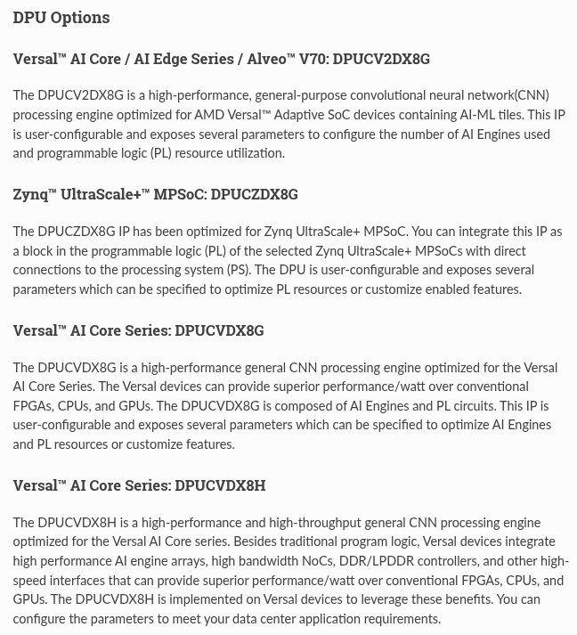
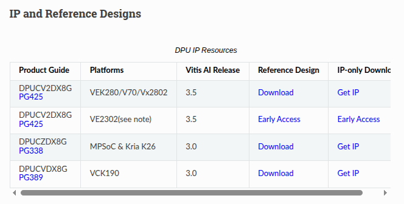

# DPU

這邊介紹 DPU 以及在 Xilinx 上如何使用，主要以 Vivado 與 Petalinux 為主。

 

## 簡介

 

---

 

# Get Start

首先須準備相對應的 IP，須注意 Xilinx 所提供的 DPU IP 會根據使用的 SoC 型號不一樣而有所不同。以我的開發板 (ZCU104, MPSoC) 為例如下圖所示，我應該要選 DPUCZDX8G。

 

 

根據官網提供資源下載即可。

 

 

在繼續之前先了解 Xilinx DPU IP 所提供的功能：

 

# Vivado

 

# Petalinux

 

# 參考

[DPUCZDX8G for Zynq UltraScale+ MPSoCs Product Guide (PG338)](https://docs.amd.com/r/en-US/pg338-dpu/IP-Facts)

[DPU IP Details and System Integration](https://xilinx.github.io/Vitis-AI/3.5/html/docs/workflow-system-integration)

 